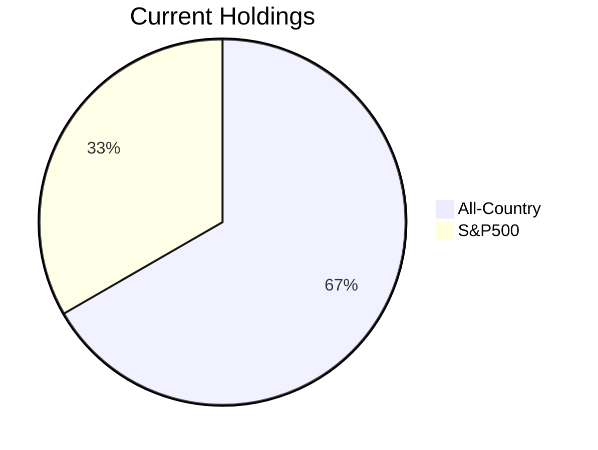
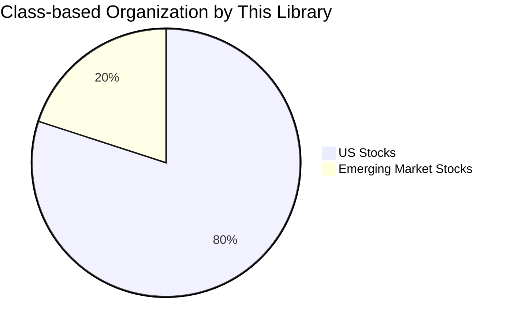

[日本語版はこちら](README_ja.md)

# Asset Allocator: Investment Trust Asset Class Decomposition Library

## Overview and Problem

In daily investment apps, assets like investment trusts are often displayed collectively, making it difficult to see their **actual class-based allocation**.

This library aims to **decompose financial products such as investment trusts into more detailed asset classes (e.g., US Stocks, Emerging Market Stocks) and calculate/visualize their allocation**. This helps users understand the true composition of their portfolio and formulate more appropriate asset allocation strategies.

---

## Allocation Image




### Example Input Files
`assets.csv`
name|principal|value
-|-|-
All-Country|100000|120000
S&P500|50000|60000

`allocations.csv`
name|class|ratio
-|-|-
All-Country|US Stocks|0.7
All-Country|Emerging Market Stocks|0.3
S&P500|US Stocks|1.0

#### Allocation Rules

If the sum of ratios is less than 1 → `undefined` class is automatically supplemented (Warning)
If the sum of ratios exceeds 1 → An error (exception) occurs
`name` must match the `name` in `assets.csv`

**Example: Automatic Supplementation of `undefined` Class**

If the sum of ratios in `allocations.csv` is less than 1, as shown below:

```
name|class|ratio
-|-|-
All-Country|US Stocks|0.7
All-Country|Emerging Market Stocks|0.1
```

A warning like `[Warning] All-Country: ratios sum to 0.80, added undefined=0.20` will be displayed during `load_allocations`, and `All-Country|undefined|0.2` will be automatically added internally.

## Usage Example
```python
from assetallocater import load_assets, load_allocations

# Load CSV files
assets = load_assets("assets.csv")
allocations = load_allocations("allocations.csv")

# Apply allocation
result = allocations * assets

# Save as CSV
result.to_csv("result.csv")

# Display results (optional)
with open("result.csv", "r", encoding="utf-8") as f:
    print(f.read())
```

### Example Output
`result.csv`
class|principal|value
-|-|-
US Stocks|150000|144000
Emerging Market Stocks|100000|36000

You can intuitively understand the actual asset allocation.

## Feature List
Feature|Description
-|-|
load_assets()|Loads asset CSV and creates an Assets object
load_allocations()|Loads allocation CSV and creates an Allocations object
__mul__()|Multiplies Allocations by Assets to generate aggregated results by asset class
to_csv()|Exports results to CSV

## Installation

Execute the following commands in the root directory of the repository.

```bash
pip install .
```

For developer installation (editable mode):
```bash
pip install -e .
```

## Development

### Testing

`pytest` is required to run tests.

```bash
pip install pytest
pytest
```

### Continuous Integration (CI)

This project utilizes Continuous Integration (CI) via GitHub Actions.
Whenever code is pushed to the `main` branch or a pull request is created, tests are automatically executed across multiple Python versions, ensuring code quality.

## License

MIT License
