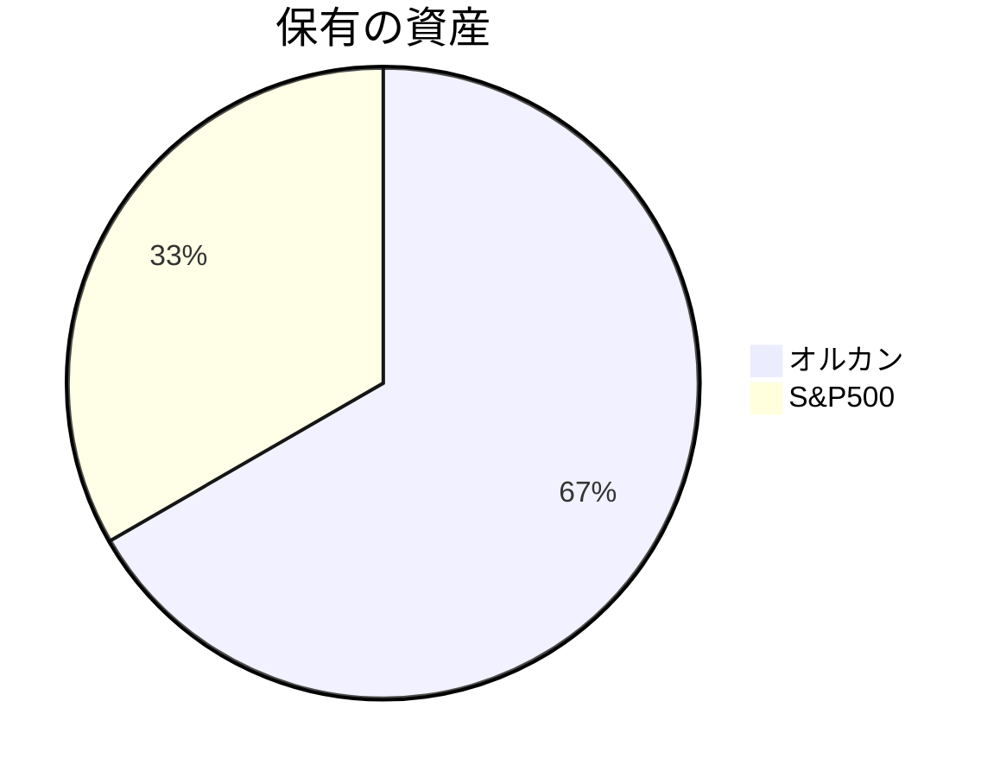
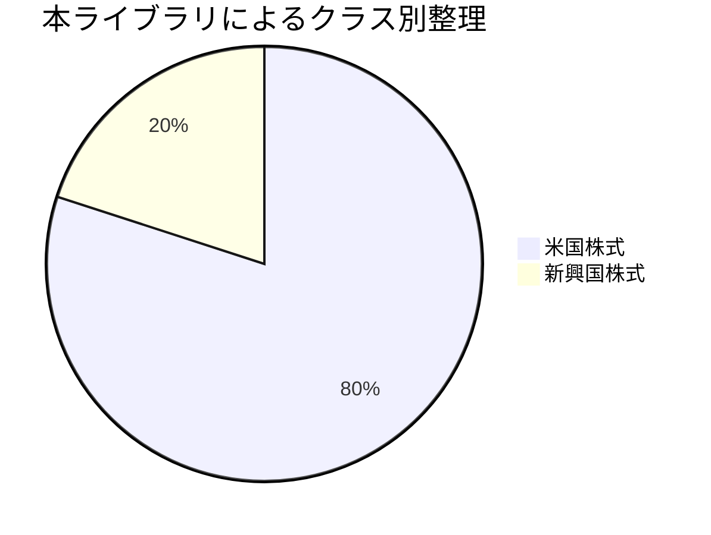

[English version here](README.md)

# Asset Allocator: 投資信託の資産クラス分解ライブラリ

## 概要と課題

日常の投資アプリでは、投資信託などの資産がまとめて表示されてしまい、**実際のクラス別配分が見えない**ことがあります。

このライブラリは、**保有する投資信託などの金融商品を、より詳細なアセットクラス（例: 米国株式、新興国株式）に分解し、その配分を計算・可視化する**ことを目的としています。これにより、自身のポートフォリオの真の構成を把握し、より適切な資産配分戦略を立てる手助けをします。

---

## 配分イメージ




### 入力ファイル例
`assets.csv`
name|principal|value
-|-|-
オルカン|100000|120000
S&P500|50000|60000

`allocations.csv`
name|class|ratio
-|-|-
オルカン|米国株式|0.7
オルカン|新興国株式|0.3
S&P500|米国株式|1.0

#### allocation のルール

ratio の合計が 1未満 → undefined クラスを自動補完（Warning）
ratio の合計が 1超過 → エラー（例外）を発生
name は assets.csv の name と一致している必要があります

**例: undefined クラスの自動補完**

もし `allocations.csv` で以下のように比率の合計が1未満の場合:

```
name|class|ratio
-|-|-
オルカン|米国株式|0.7
オルカン|新興国株式|0.1
```

`load_allocations` 時に `[Warning] オルカン: ratios sum to 0.80, added undefined=0.20` のような警告が表示され、内部的に `オルカン|undefined|0.2` が自動的に追加されます。

## 使用例
```python
from assetallocater import load_assets, load_allocations

# CSVの読み込み
assets = load_assets("assets.csv")
allocations = load_allocations("allocations.csv")

# 配分を適用
result = allocations * assets

# CSVとして保存
result.to_csv("result.csv")

# 結果の表示 (オプション)
with open("result.csv", "r", encoding="utf-8") as f:
    print(f.read())
```

### 出力例
`result.csv`
class|principal|value
-|-|-
米国株式|150000|144000
新興国株式|100000|36000

You can intuitively understand the actual asset allocation.

## 機能一覧
機能|内容
-|-|
load_assets()|資産CSVを読み込んで Assets オブジェクトを生成
load_allocations()|配分CSVを読み込んで Allocations オブジェクトを生成
__mul__()|AllocationsとAssetsを乗算し、アセットクラス別の集計結果を生成
to_csv()|結果をCSV出力

## インストール

リポジトリのルートディレクトリで以下のコマンドを実行します。

```bash
pip install .
```

開発者としてインストールする場合（編集可能モード）:
```bash
pip install -e .
```

## 開発

### テスト

テストを実行するには `pytest` が必要です。

```bash
pip install pytest
pytest
```

### 継続的インテグレーション (CI)

このプロジェクトでは、GitHub Actions を利用した継続的インテグレーション (CI) が導入されています。
コードが `main` ブランチにプッシュされるか、プルリクエストが作成されるたびに、複数のPythonバージョンで自動的にテストが実行され、コードの品質が保証されます。

## ライセンス

MIT License